# Testing and Deployment Strategy

This document explains how the project ensures code quality through automated testing before any deployment to GitHub Pages.

## 🛡️ Multi-Layer Protection

The project uses a **three-layer protection strategy** to ensure only well-tested code reaches production:

### 1. Local Development Protection (Optional)
- **Pre-commit hooks** run tests before allowing commits
- Catches issues early in the development process
- Can be bypassed with `--no-verify` if needed (not recommended)

### 2. CI/CD Testing Gate
- **GitHub Actions workflows** run tests before any deployment
- Both deployment and daily data workflows include testing
- Deployment is completely blocked if tests fail

### 3. Comprehensive Test Coverage
- **26 unit tests** covering critical parsing functionality
- **93.38% statement coverage** of core parsing code
- Tests for all 3 date extraction patterns
- Edge case handling and error scenarios

## 🚀 Deployment Workflow

### GitHub Pages Deployment Process

```mermaid
flowchart TD
    Push[Push to main branch] --> Test{Run Tests}
    Test -->|✅ Pass| Build[Build Application]
    Test -->|❌ Fail| Reject[❌ Deployment Rejected]
    Build -->|✅ Success| Deploy[Deploy to GitHub Pages]
    Build -->|❌ Fail| Reject
    Deploy --> Live[🌐 Live on GitHub Pages]
```



**Workflow file:** `.github/workflows/deploy-web.yml`

**Triggers:**
- Push to `main` branch with changes to `web/` directory
- Changes to `daily-notams/` data files
- Manual workflow dispatch

**Process:**
1. **Test Job** - Runs all unit tests with coverage
2. **Build Job** - Only runs if tests pass
3. **Deploy Job** - Only runs if both tests and build succeed

### Daily NOTAM Fetch Workflow

**Workflow file:** `.github/workflows/daily-notam-fetch.yml`

**Additional Safety:**
- Tests run before fetching and processing new NOTAM data
- Prevents corrupted data from being committed if parser breaks
- Scheduled daily at 2:00 AM UTC

## 🧪 Running Tests

### Local Development

```bash
# Run all tests
npm test

# Run tests in watch mode during development
npm run test:watch

# Generate coverage report
npm run test:coverage

# Run tests in CI mode (same as GitHub Actions)
npm run test:ci
```

### Setting Up Pre-commit Hooks

```bash
# Install pre-commit hook (one-time setup)
npm run setup-hooks

# Or manually
bash scripts/setup-pre-commit.sh
```

Once installed, tests will run automatically before each commit:

```bash
git commit -m "Your changes"
# 🧪 Running pre-commit tests...
# ✅ All tests passed! Proceeding with commit.
```

To bypass the hook temporarily (not recommended):
```bash
git commit --no-verify -m "Emergency fix"
```

## 📊 Test Coverage Details

### Core Functionality Tested

**parseHtmlContent Function:**
- ✅ HTML `<div>` element parsing
- ✅ HTML `<td>` element parsing  
- ✅ Multiple NOTAMs in single document
- ✅ Duplicate removal by ID
- ✅ Malformed HTML handling
- ✅ Text cleaning and map link extraction
- ✅ Case normalization

**Date Extraction Patterns:**
- ✅ **Pattern 1**: `FROM 2501011200 TO 2501011800`
- ✅ **Pattern 2**: `VALID FROM 15 JAN 2025 08:00 TO 15 JAN 2025 20:00`
- ✅ **Pattern 3**: `WEF 02 OCT 2025`, `TILL 25 APR 2025`
- ✅ Cross-day/month validity periods
- ✅ All month abbreviations
- ✅ Permanent NOTAMs
- ✅ Case-insensitive matching

### Coverage Statistics

```
File        | % Stmts | % Branch | % Funcs | % Lines
------------|---------|----------|---------|--------
scraper.ts  |  93.38% |   80.55% |  93.33% |  96.49%
```

## 🚨 What Happens When Tests Fail?

### During Local Development
```bash
❌ Tests failed! Commit rejected.
Please fix the failing tests before committing.
```

### During GitHub Actions
- **Red X** appears next to the commit in GitHub
- **Deployment is completely blocked**
- **GitHub Pages remains on last known good version**
- **Email notification** sent to repository maintainers
- **Action logs** show specific test failures

### In the Actions Tab
You'll see a workflow run with status:
- ❌ **test** job failed
- ⏹️ **build** job skipped  
- ⏹️ **deploy** job skipped

## 🔧 Troubleshooting

### Tests Fail Locally
```bash
# Get detailed test output
npm run test:coverage

# Run specific test file
npx jest scraper.test.ts

# Run tests matching a pattern
npx jest --testNamePattern="parseHtmlContent"
```

### Tests Pass Locally But Fail in CI
- Ensure Node.js version matches (v20)
- Check for environment-specific dependencies
- Verify all files are committed
- Look at the GitHub Actions logs for specific errors

### Emergency Deployment Override
If you absolutely need to deploy without tests (NOT RECOMMENDED):

1. Create a separate workflow file without the test dependency
2. Use workflow dispatch with manual approval
3. Fix the tests immediately after deployment

## 📈 Future Enhancements

Potential additions to the testing strategy:

- **Integration tests** for the complete scraping workflow
- **End-to-end tests** for the web application
- **Performance benchmarks** to catch regressions
- **Visual regression tests** for UI changes
- **Automated security scanning**

## 🎯 Best Practices

1. **Write tests first** when adding new features
2. **Update tests** when modifying existing functionality
3. **Run tests locally** before pushing
4. **Check coverage reports** to identify untested code
5. **Don't bypass tests** unless absolutely necessary
6. **Monitor deployment status** in GitHub Actions
7. **Fix failing tests immediately** to unblock deployments

---

This testing strategy ensures that the NOTAM parser remains reliable and stable, with automatic prevention of broken code reaching production users.
